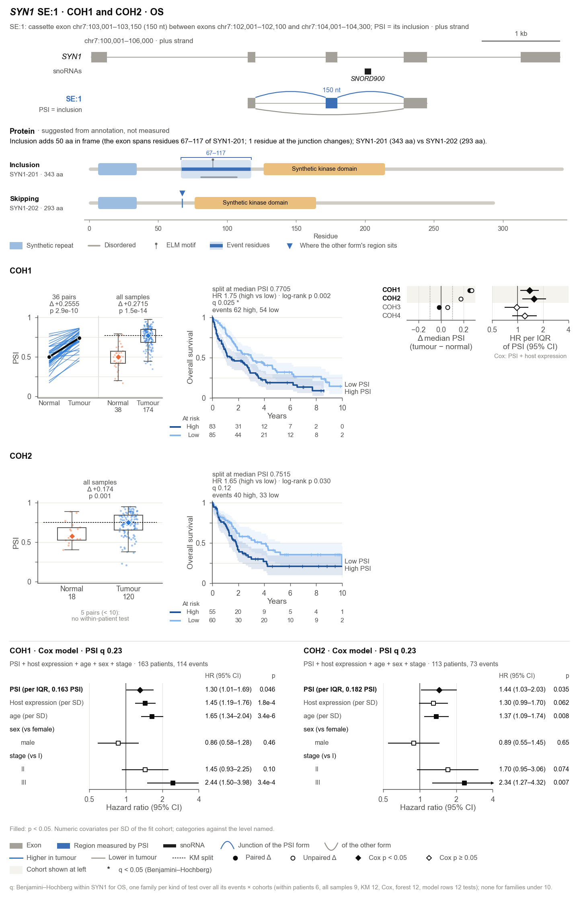

# splice-assay

Case-vs-reference and survival panels for alternative-splicing events, from plain tables.

Give it PSI values, a sample sheet, survival data and the coordinates of your events. For any event it computes:
- tests between two groups (tumour vs normal, or any two groups you name), within patients and across all samples;
- a median-split Kaplan–Meier test per cohort;
- a Cox model per cohort, adjusted for host-gene expression and any clinical variables you choose.

It then draws one figure per event: the event on its gene, the group comparison, the survival curves, a forest of
every cohort, and optionally the full Cox model of each cohort shown. With expression data, the host gene's own
expression gets the same views (tumour vs normal, KM, Cox on expression + clinical). That is one "assay" figure per
event.



*The example uses simulated data: `splice-assay example demo/`.*

## Guides

- [Reading the results, panel by panel](docs/reading-results.md): every part of a page, the probe's report and
  tables, and a reading order.
- [Getting the annotation cache from SpliceImpactR](docs/annotation-cache.md): what the protein suggestions need,
  and how to build it.
- [Methods](docs/methods.md): every statistic and threshold.
- [Protein suggestions](docs/proteins.md): how events are matched to transcripts, and what the band shows.
- [Agent guide](AGENT_GUIDE.md): the steps from data to report, for agents and new users.

## Install

```bash
pip install "splice-assay @ git+https://github.com/zachpwakefield/Splice-Assay"
```

Or, from a clone:

```bash
pip install -e ".[test]"
```

Python 3.10 or newer is required. The dependencies are numpy, pandas, scipy, matplotlib and lifelines; add `pyarrow`
to read Parquet. The command is `splice-assay` and the Python package is `splice_assay`.

## Quick start

```bash
splice-assay example demo/                     # simulated data, results and four figures
splice-assay validate demo/data                # check your tables; per-cohort counts
export SPLICE_ASSAY_GTF=demo/data/annotation.gtf
export SPLICE_ASSAY_PROTEINS=demo/proteins     # optional: the suggested protein change on every page

# not sure where to look? probe every event of a gene in every cohort: ranked, one page per event
splice-assay probe demo/data --gene SYN1       # -> probe_SYN1_OS/report.md, probe.pdf, pages/

# one event: the most promising cohorts, OS, and models adjusted for age + sex + stage are the defaults
splice-assay panel demo/data --event SYN1:SE:1 --out figures/

# or choose everything yourself
splice-assay panel demo/data --event SYN1:SE:1 --cohort COH1 --cohort COH2 --endpoint DSS \
    --detail-covariate age --detail-covariate stage --baseline stage=I --out figures/
splice-assay analyse demo/data --out results/  # statistics for every event x cohort x endpoint, as CSV
```

An agent (or a new user) should read [AGENT_GUIDE.md](AGENT_GUIDE.md): the steps from data to report, how to read a
probe, and what not to claim.

In Python:

```python
import splice_assay as sa

ds = sa.Dataset.from_dir("demo/data")          # or sa.Dataset.from_tables(samples=df, psi=df, ...)
res = sa.analyse(ds)                           # res.groups, res.survival, res.cox_terms
clinical = sa.CoxModel().with_clinical(["age", "sex", "stage"], baseline={"stage": "I"})
panel = sa.event_panel(ds, "SYN1:SE:1", ["COH1", "COH2"], "OS", gtf="demo/data/annotation.gtf",
                       detail=clinical, out_dir="figures/")    # panel.figure is a matplotlib Figure
sa.cox_model_figure(ds, "SYN1:SE:1", "COH1", "OS", model=clinical, out_dir="figures/")
```

## Input tables

Put the tables in one folder, named `<table>.csv` (or `.tsv`, `.txt`, `.parquet`), or pass DataFrames. There is one
row per record, and IDs are read as text.

| Table | Required columns | Optional columns |
|---|---|---|
| `samples` | `sample_id`, `patient_id`, `cohort`, `group` | `role` (case/reference), `survival_cohort` (true/false) |
| `psi` | long: `event_id`, `sample_id`, `psi`; or wide: `event_id` + one column per sample | |
| `events` | `event_id`, `gene`; to draw also `chrom`, `strand`, `event_type`, `constant`, `variable` | `label`, `gene_id`, `expression_gene`, `psi_junctions`, `other_junctions` |
| `survival` | long: `patient_id`, `endpoint`, `time`, `event`; or wide: `OS.time` + `OS`, `DSS.time` + `DSS`, … | |
| `pairs` | `cohort`, `patient_id`, `case_sample`, `reference_sample` | |
| `expression` | long: `gene`, `sample_id`, `value`; or wide: `gene` + one column per sample | |
| `clinical` | `patient_id` | any covariates: age, sex, stage, … |

### Two tables are enough

The patient-level tables can be columns of `samples`, and the event table can be columns of `psi`:

| Table | Columns |
|---|---|
| `samples` | `sample_id`, `patient_id`, `cohort`, `group`, plus survival columns (`OS.time`, `OS`, `DSS.time`, `DSS`, …), plus any clinical columns (age, sex, stage, …), plus an optional `pair_id` |
| `psi` | the event columns (`event_id`, `gene`, `chrom`, `strand`, `event_type`, `constant`, `variable`, …) and one PSI column per sample |

How the combined tables are read:
- **Survival and clinical values** come from each patient's survival sample (one tumour per patient). They may be
  repeated on the patient's normal rows or left empty there.
- **Pairs.** Samples sharing a `pair_id` within a cohort form a pair. Without `pair_id`, a patient's one tumour and
  one normal sample are paired.
- **Separate tables** still work and take precedence. `validate` says where each table came from.

### Subsets (e.g. one subtype)

`--keep FILE` restricts any command to the patients listed in a table. The first column holds the IDs, or name the
column with `--keep-column`.
- **Which IDs match.** Patient IDs, sample IDs, or barcodes that start with either. TCGA aliquot barcodes such as
  `TCGA-XX-0001-01A-11R-0000-07` select patient `TCGA-XX-0001`.
- **What is kept.** All samples of a selected patient, so its normal samples stay for the tumour–normal views.
- **Where it shows.** `validate` reports the subset, the probe report states it, and page titles end with
  "subset: <file>".

```bash
splice-assay probe data/ --gene EHMT2 --keep Her2_samples.tsv
```

`--where COLUMN=VALUE` selects by a column of the clinical or samples table instead, for example
`--where Subtype=Her2`.
- **Matching.** Values match case-insensitively; `--where stage=II,III` accepts either value.
- **Several conditions.** Repeat `--where`; all conditions must hold, and `--keep` can be added.
- **What is kept.** All samples of a selected patient, as with `--keep`.

Small subsets often have too few deaths for Cox (30 patients and 20 events by default). The KM tests still run, and
the probe ranks by them when no Cox model can be fitted.

### Your own column names

Nothing needs renaming. Map the logical names above to your columns:

```bash
splice-assay validate data/ --column sample_id=File.ID --column patient_id=Case.ID --column cohort=cancer \
    --column group=sample_type --case "Primary Tumor" --reference "Solid Tissue Normal"
```

In Python this is `Dataset.from_dir(..., columns={...}, case=..., reference=...)`.

### Missing-value codes

Empty cells, `NA` and `NaN` are read as missing. Clinical files often use other codes, such as "missing" or
"[Not Available]". Declare those codes with `--na-value missing` (repeatable) or `na_values=[...]`. Otherwise a code
becomes a category of its own in the Cox model.

### Groups

- **Any two conditions.** `group` holds each sample's condition, with whatever names you use (`tissue` is accepted
  too): Responder / Non-responder, Metastasis / Primary, IDH-mutant / IDH-wildtype, …
- **Which is the case.** Effects are case minus reference. The two groups are named, in order of precedence:
  - by `--case` and `--reference` (`case=`, `reference=` in Python);
  - else by an optional `role` column in the samples table: `case` or `reference` (`control` is accepted too);
  - else as tumour and normal.
- **Matching.** Matching ignores case, and "tumor" equals "tumour".
- **Labels.** Figures, tables and the probe report use the names as spelled in `group`, for example "Higher in
  responder" and "Δ median PSI (metastasis − primary)". Names with inner capitals (IDH-mutant) keep them.
  `--case-label` and `--reference-label` change the displayed names only.
- **Other groups.** Samples of any other group are set aside, with a warning.

### Survival

- **One tumour per patient.** Survival analysis uses one case sample per patient. If a patient has several, mark one
  with `survival_cohort`.
- **Wide or long.** Survival can be long, or wide with one time/event column pair per endpoint (e.g. `OS.time` and
  `OS`). Wide pairs are detected automatically.
- **Units.** Time is in days by default (`Settings(time_unit=...)`).
- **Dropped rows.** Rows with a missing or non-positive time are dropped and counted.

### Without reference samples

If your data have no reference group, for example a tumour-only cohort with outcomes, figures leave out the group
view and the Δ forest and show only survival.

### Event geometry

Coordinates are 0-based and half-open (BED and rMATS convention), written `start-end` and joined with `;`.

| `event_type` | `constant` | `variable` (the region PSI measures) |
|---|---|---|
| `SE` | the two flanking exons | the cassette exon |
| `RI` | the two exons around the intron | the intron |
| `A3SS`, `A5SS` | the short form of the alternative exon, and the flanking exon | the extension of the long form |
| `MXE` | the two flanking exons | the exon PSI measures, then the other exon |

The junctions of both forms follow from these coordinates. For any other event type, give `psi_junctions` and
`other_junctions` (introns as `donor-acceptor`) to draw arcs. Genes much longer than their events (over 3× and over
20 kb) are drawn around the events only, with marks where the gene continues.

### From rMATS

```bash
splice-assay import-rmats rmats_out/ --b1 b1.txt --b2 b2.txt --counting JCEC --out my_data/
```

This writes `events.csv` (with geometry) and `psi.csv` (from `IncLevel1`/`IncLevel2`, named after the BAM files).
With `--one-table` it writes one `psi.csv` holding the event columns and the PSI values. Add `samples.csv` to the
same folder; survival and clinical columns can go in it, or in their own tables. For MXE events, PSI is taken to measure the transcript-upstream
exon; see `splice_assay.rmats` and check one known event in your data.

## Probing: when you are not sure what to look at

`splice-assay probe DATA --gene GENE` runs every event of the gene (or `--event ...`, or every event in the data) in
every cohort for one endpoint (OS unless `--endpoint`). Repeat `--endpoint` (or use `--endpoint all`) to probe
several endpoints. Each gets its own folder (`probe_GENE_OS`, `probe_GENE_DSS`, or `OUT/OS` with `--out`), because
OS and DSS are never mixed in one figure. It fits two Cox models per cell:
- the base model: PSI + host expression;
- the adjusted model: + age + sex + stage (see below).

It writes:

| File | Content |
|---|---|
| `report.md` | What was run, how many p < 0.05 chance would give, and the ranked events with links to their pages |
| `events.csv` | One row per event, ranked: significant cohorts (adjusted, base, with directions), group hits, best cohort |
| `cells.csv` | One row per event × cohort: every statistic, base and adjusted, with BH q values within each gene |
| `overview.png` | Events × cohorts: HR colour, p < 0.05 dot, group-hit frame |
| `pages/`, `probe.pdf` | One assay page per ranked event, and all of them in one PDF |

Events measurable in at least one cohort come first. The ranking then orders events by these criteria in turn:
1. cohorts where the adjusted Cox p < 0.05;
2. cohorts where the base Cox p < 0.05;
3. cohorts with both a group hit and a survival hit;
4. cohorts where the KM p < 0.05;
5. the smallest p: adjusted Cox, else base Cox, else KM (when no Cox model can be fitted).

Each page shows that event's most promising cohorts (`--top`, default 3; `--top all` shows every cohort with a
test, one row each) and every cohort in the forest.

More than 6 cohorts are split over balanced pages (`_p1`, `_p2`, …, "page 1 of 3" in the title), each with the
full forest. Change the split with the `cohorts_per_page` setting (0 = one page).

A probe ranks candidates; it does not test a hypothesis.

## Protein consequences (optional)

Give splice-assay a protein cache and it suggests how each event could change the protein. It chooses the annotated
transcripts of the two forms with SpliceImpactR's matching, then compares their proteins. Each page gets a protein
band (both isoforms, domains, the event's residues), and probes get a Protein column.

```bash
splice-assay protein-cache ~/splice_assay_annotation --out protein_cache/   # once (docs/annotation-cache.md)
export SPLICE_ASSAY_PROTEINS=protein_cache/                          # or --proteins on panel, panels and probe
splice-assay proteins data/ --gene FNBP1      # e.g. "inclusion adds 61 aa in frame (residues 330–390 of FNBP1-202)"
```

These are suggestions read from annotation; an event without a good match is not shown. The example writes a small
synthetic cache (`demo/proteins/`). [docs/annotation-cache.md](docs/annotation-cache.md) shows how to build the real
one with SpliceImpactR. [docs/proteins.md](docs/proteins.md) covers the matching, the cache format for other
annotation, and checks against SpliceImpactR.

## Defaults (nothing needs to be chosen)

| Setting | Default | Change with |
|---|---|---|
| Cohorts | all; pages show the most promising 3 | `--cohort`, `--top N` or `--top all` |
| Endpoint | OS | `--endpoint` (repeatable in `probe`, or `all`) |
| Groups | tumour vs normal | `--case`, `--reference` |
| Subset | every patient | `--keep FILE`, `--where COLUMN=VALUE` |
| Adjustment | host expression, plus age, sex and stage found in the clinical table | `--covariate`, `--no-adjust`, `--no-detail` |
| Baselines | stage I, female (a level with < 10 patients or no deaths joins its neighbour) | `--baseline stage=II`; settings `level_min_patients` |
| Model notes | under 10 events per term; PSI IQR under 0.05 | settings `cox_events_per_term`, `narrow_psi_below` |
| Cohorts per page | 6 (more are split over pages) | settings `cohorts_per_page` |
| GTF | `$SPLICE_ASSAY_GTF` | `--gtf` |
| Protein cache | `$SPLICE_ASSAY_PROTEINS` (none: no protein band) | `--proteins`, `--no-proteins` |
| Expression rows | shown when an expression table is given | `--no-gex` |

**How age, sex and stage are found.**
- **Names.** Columns named like `age`, `age_at_diagnosis`, `sex`, `gender`, `stage` or `ajcc_pathologic_stage` are
  used.
- **Cleaning.**
  - Stage is collapsed to its Roman numeral ("Stage IIA" becomes II).
  - Sex becomes female or male.
  - Other codes, such as "[Not Available]" or "missing", become missing.
- **Variables missing in a cohort.** A variable recorded for fewer than 80% of a cohort's patients is left out of that
  cohort's model rather than shrinking it; the page says so. This is typical of stage in brain tumours.
- **Rare categories.** A level with fewer than 10 patients in a cohort, or with no deaths, cannot be estimated, so it
  joins its neighbour: stage I with 2 patients becomes part of "I–II", which is then the reference. Other categories
  join the most common level. The page lists each merge. Change the limit with `level_min_patients` (0 = never).
- **Notes.** These warn without changing any result:
  - fewer than 10 events per model term (an overfit risk);
  - a PSI IQR below 0.05 in the fit cohort, so the HR per IQR covers a few PSI points;
  - non-proportional hazards: a term's Schoenfeld test, or the KM split's, has p < 0.05, so the effect changes over
    follow-up.

  Settings `cox_events_per_term`, `narrow_psi_below`, `narrow_psi_measure` (`iqr` or `sd`) and `ph_note_below`
  control them.

## The Cox model

- **Default model.** PSI (per 0.10) plus host-gene expression, z-scored within the cohort, whenever an expression
  table is given; PSI alone otherwise.
- **Adding clinical variables.** Name clinical columns as covariates:
  - numeric columns enter per SD of the cohort;
  - other columns enter as categories against their most common level, or against the level you name with
    `--baseline stage=I`;
  - `--categorical` forces a numeric code to be treated as categories;
  - `--strata` gives a separate baseline hazard per level;
  - `--no-expression` drops the expression term.

```bash
splice-assay analyse data/ --out results/ --covariate age --covariate stage --strata sex
```

- **What the forest shows.** The HR per IQR of PSI from this model, with the model written under the axis. The HR per
  IQR is the hazard ratio between a patient at the 75th and one at the 25th percentile of PSI in that cohort, with the
  other variables held fixed.
- **Terms table.** `cox_terms.csv` holds every term of every fitted model.
- **The model band.** `panel --detail` adds the full model of each cohort shown to the figure, below the KM panels.
  Each term gets an HR, a 95% CI and p, and the forests of the band share one axis.
  - `--detail-covariate` (with `--detail-categorical` and `--detail-strata`) adds clinical terms to the band only.
  - The cross-cohort forest then keeps the model every cohort supports. Clinical variables are often missing or
    coded differently between cohorts.
- **Any number of cohorts.**
  - With one or two cohorts at left, the models sit in a band below them.
  - From three, each cohort's row carries its own model at the right, aligned on one axis, and the cross-cohort
    forest moves below at full width.
  - `--layout side` or `--layout stacked` forces either.
- **One model on its own.** `splice-assay cox` prints and draws one model with all its terms.

## Multiple testing

Each splicing p value has a Benjamini–Hochberg q within its gene, with each kind of test as its own family:
- within-patient tests;
- all-samples tests;
- KM;
- the Cox PSI term (per endpoint and model).

The pages print q beside p and name the family in a footnote. Families of fewer than 10 tests get no q. Hit rules,
filled markers and the probe ranking stay on p. Details: [docs/methods.md](docs/methods.md#multiple-testing-q-values).

## Host-gene expression rows

When an expression table is given, every page also shows the host gene's own expression for each cohort shown:
- case vs reference (pairs and all samples);
- a KM split at its median;
- the Cox model OS ~ expression + the same clinical terms as the model rows (HR per SD).

This answers whether the gene's level itself is prognostic or shifted, next to the splicing result. The splicing
models already adjust PSI for expression. The probe writes these statistics for every cohort to
`expression_cells.csv`. `--no-gex` leaves the rows out. Expression comes from the expression table, matched by the
event's `gene` (or `expression_gene`). Normals need values too for the case-vs-reference view.

## Outputs

- **Statistics.** `analyse` writes three tables. Every column is defined in [docs/methods.md](docs/methods.md).
  - `group_tests.csv`: one row per event × cohort.
  - `survival.csv`: one row per event × cohort × endpoint.
  - `cox_terms.csv`: one row per model term.
- **Protein changes.** With a protein cache, `proteins --out` and the probe's `proteins.csv` hold one row per event
  (see [docs/proteins.md](docs/proteins.md)).
- **Figures.** `panel` and `cox` write four kinds of file:
  - `<stem>.svg`, `.pdf` and `.png` (400 dpi);
  - `<stem>.csv`, with every plotted value;
  - `<stem>.provenance.json`, with input hashes, settings, the model and versions.
- **Reproducibility.** The same inputs, settings and library versions give byte-identical files.

### Figure options

- **Highlighting.** `--highlight table.csv` marks forest cells with a short label, such as a tier letter. Its columns
  are `event_id`, `cohort`, `label`, and optionally `endpoint` and `colour`. `--highlight-title Tier` names the
  column.
- **Batch figures.** `splice-assay panels data/ --spec panels.csv` makes many figures from a table.
  - Columns: `events` and `cohorts` (both separated by `;`), `endpoint`, and optionally `stem`.
  - The statistics are computed and the GTF is read only once.
- **Two events.** Two events of the same gene can share a figure, for example two retained introns.
- **Smaller GTF.** `splice-assay gtf-subset gencode.gtf.gz --events events.csv --out small.gtf.gz` keeps only the
  records near your events.

## Settings

Every threshold has a default taken from the analysis these figures were designed for. You can change any of them
with a JSON file (`--settings my.json`) or in Python (`sa.Settings(min_pairs=5)`). The main defaults:

- **Groups.** 10 pairs for the paired test; 10 case and 10 reference samples for the unpaired test. A hit needs
  p < 0.05 and |Δ median PSI| > 0.10, and must be robust to PSI values of exactly 0 or 1.
- **Survival.**
  - PSI observed in at least 50% of the survival samples, with at least 10 values away from the mode.
  - KM: 10 patients per arm and 10 events.
  - Cox: 30 patients and 20 events.

## Scope and limits

- **Figure scope.** One endpoint per figure, and one or two events of one gene.
- **p values.** Nominal. q values (Benjamini–Hochberg within each gene, one family per kind of test) are printed
  beside them; hits, filled markers and the probe ranking use p.
- **Causality.** Cox models describe association; they do not establish causation.
- **Patient-level data.** None is shipped; the example is simulated.
- **Protein changes.** Suggestions from annotated isoforms, not measurements (see [docs/proteins.md](docs/proteins.md)).

## Citation and licence

- **Licence.** GNU General Public License, version 3 only ([LICENSE](LICENSE)), as for SpliceImpactR, whose
  transcript matcher the protein layer ports.
- **Citation.** A citation file will follow; until then, cite this repository.
