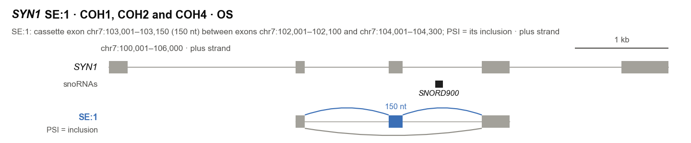
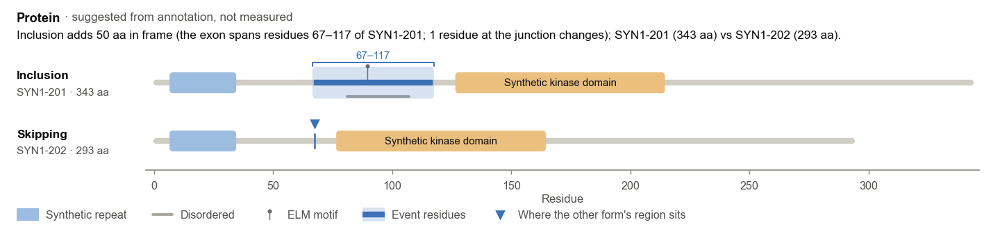
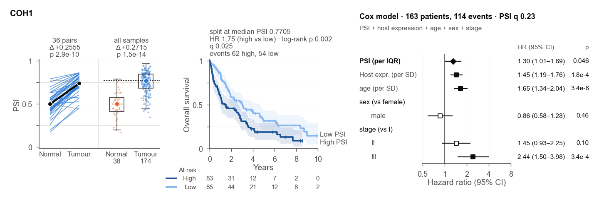
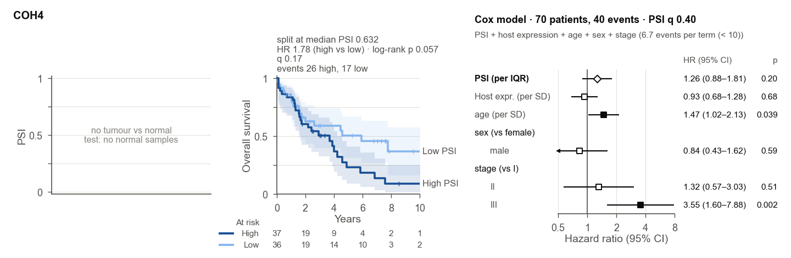
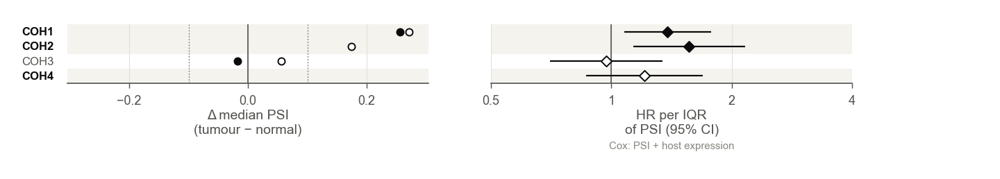
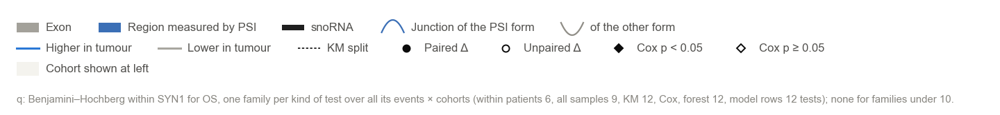
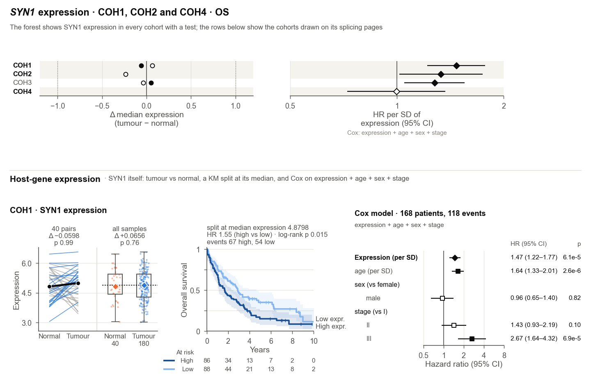
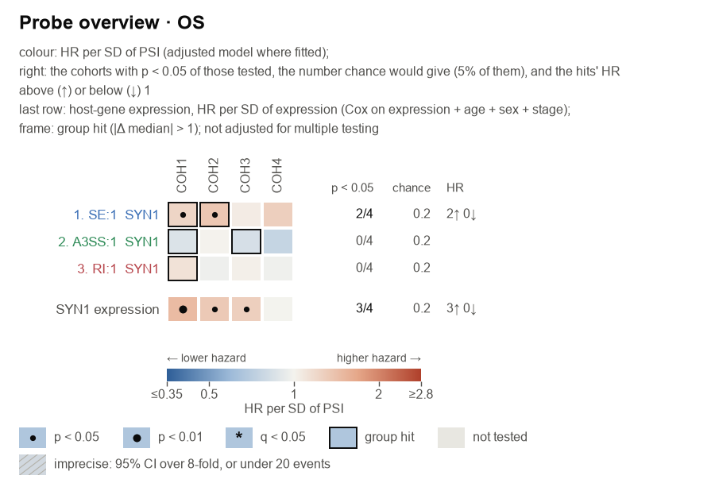

# Reading the results, panel by panel

A probe writes a report, an overview, one assay page per ranked event and the host gene's expression page. `panel`
draws the same pages for the cohorts you choose. This guide walks through one assay page from top to bottom, then the
expression page and the probe's files.

The figures come from the synthetic example, so you can open the same files: run `splice-assay example demo/`, then
`splice-assay probe demo/data --gene SYN1 --gtf demo/data/annotation.gtf --proteins demo/proteins`. The cohorts are
COH1 to COH4, and "tumour" and "normal" stand for your case and reference groups. The page shows SYN1:SE:1 in
three cohorts:
- COH1, with matched pairs;
- COH2, with too few pairs for a within-patient test;
- COH4, with no normal samples.

## The assay page

### 1. Title and gene schematic

- **Title.** Gene, event, the cohorts drawn and the endpoint. A subset (`--keep`, `--where`) and "page i of n" for a
  split page are added at the end.
- **Event details.** One line per event under the title: what the event is, its coordinates (1-based, inclusive, as a
  genome browser shows them), its length, what its value measures and the strand. Check it against the event you
  meant to look at.
- **Gene track.** The gene's collapsed model from the GTF: exons used by at least 10% of its transcripts. Nested small
  RNAs (snoRNAs, scaRNAs) are drawn in black underneath.
- **Event row.**
  - Grey blocks are the exons both forms share.
  - The coloured block is the region PSI measures, coloured by event type, with its length above.
  - Arcs above are the junctions of the form PSI counts; arcs below belong to the other form.
  - "PSI = inclusion" (or retention, …) says which form a high PSI means.
- **HITindex events.** For an alternative first or last exon (AFE, ALE), the grey blocks are the gene's other first
  or last exons and PSI is this exon's share of them. For a HIT event the value is the HIT index, from −1 (used as a
  first exon) to 1 (used as a last exon); the page says "HIT index" wherever it would say PSI, and its axes run
  from −1 to 1. HIT events appear only when asked for (`--include-hit`, or an event named with `--event`), and the
  footnote's q families then cover the gene's HIT-index events only.

### 2. Protein band (with a protein cache)

- **The sentence** says what the event would do to the protein: extra or missing residues in frame, a frameshift, or
  a change only in the UTR. It names the two annotated transcripts and their lengths. It is a suggestion read from
  annotation, never a measurement.
- **The bars** are the two forms' proteins on one residue axis.
  - Domains and repeats are boxes, disordered regions grey lines, and short motifs pins.
  - The event's residues are highlighted, and the triangle marks where the other form's region sits.
- **No band** means no protein cache was given ([getting one](annotation-cache.md)), or no annotated transcript
  matches the event.

### 3. One cohort row: group view, KM curve, Cox model

**Left: tumour vs normal.** Two views share the PSI axis.
- **Pairs.** One line per patient with both samples: blue when PSI is higher in the tumour, grey when lower. The black
  line joins the medians.
  - The header gives the number of pairs.
  - Δ is the median of the within-patient differences.
  - p comes from the exact signed-rank test.
- **All samples.** Every reference and case sample, with boxes; diamonds mark the medians.
  - Δ is the median of the tumours minus the median of the normals.
  - p comes from the Mann–Whitney test.
  - The dotted line is the KM split.
- **Hits and q.** A design is a hit when p < 0.05, |Δ| > 0.10, the Hodges–Lehmann shift agrees in sign, and the result
  survives dropping PSI values of exactly 0 or 1. A q line appears when the gene has at least 10 such tests.

**Middle: Kaplan–Meier.** The cohort is split at the median PSI of its survival samples (or the mean, or a value set
with `--km-split`); PSI at or below the split is the low arm.
- **Header.**
  - The split: "split at median PSI 0.7705", or "split at PSI 0.5 (set)" for a value you gave.
  - The log-rank HR (high vs low) and p, then q and the events per arm.
- **Curves.** 95% bands, with ticks for censored patients. The at-risk table counts patients still followed.
- **A † after the log-rank p**, with a last line "† non-proportional hazards (p …)": the hazard ratio between the arms
  changes over follow-up, for example when the curves cross. The log-rank test still ran; it averages that change.

**Right: the Cox model** of this cohort, adjusted for host expression and the clinical terms (by default age, sex and
stage).
- **Header.** Patients and events in the fit, and the q of the PSI term. The second line gives the model, with any
  notes in brackets (next section).
- **Rows.** Each term's HR with its 95% CI and p, on one shared axis.
  - PSI is per IQR of PSI in this cohort (bold, diamond). Host expression and age are per SD. Categories are against
    the reference level named.
  - Filled markers have p < 0.05.
  - A † after a row's p: that term failed the proportional-hazards test (p < 0.05), so its HR is an average over
    follow-up.

### 4. When a cohort cannot be fully tested, and model notes

- **Missing group view.**
  - "No tumour vs normal test: no normal samples" (COH4) means the cohort has no reference samples.
  - "5 pairs (< 10): no within-patient test" (COH2) means only the all-samples comparison ran.
- **KM or Cox not run.** The panel names the gate that stopped it: PSI too sparse, too few patients or events, or no
  variation.
- **Model notes** in brackets are cautions. The model was fitted and nothing is removed:
  - `6.7 events per term (< 10)`: few deaths for the number of terms, so expect wide CIs (an overfit risk);
  - `narrow PSI range (IQR 0.040 < 0.05)`: the HR per IQR describes a change of a few PSI points;
  - `non-proportional hazards: PSI (p …)`: that term's effect changes over follow-up, so the HR is an average. Look at
    the KM curves;
  - `stage I merged into II (2 patients, 0 events)`: a level too rare to estimate joined its neighbour, so the
    reference reads "I–II";
  - `stage left out (0% recorded)`: a covariate recorded for under 80% of the cohort is not in its model;
  - `unstable: …`: a covariate term with a standard error above 3.

### 5. The forest of all cohorts

- **Left.** The median PSI difference (tumour − normal) in every cohort with a test. Filled circles are within
  patients, open circles all samples. Dotted lines mark the ±0.10 effect threshold.
- **Right.** The HR per IQR of PSI with its 95% CI, from the base model (PSI + host expression, written under the
  axis), so all cohorts are compared under one model.
  - Filled diamonds have p < 0.05.
  - Arrowheads mark a CI that runs off the axis.
  - A † after a CI: the PSI term of that fit failed the proportional-hazards test.
- **Shading** marks the cohorts drawn above. Look for the same direction across cohorts.

### 6. Legend and footnote

- **The legend** covers every symbol on the page. When the page carries a †, the legend adds "† non-proportional
  hazards (p < 0.05)".
- **The footnote** names the q families with their sizes (Benjamini–Hochberg within the gene, one family per kind of
  test) and lists any setting changed from the defaults. A page from relaxed gates always says so.

## The expression page

With an expression table, the host gene's own expression has a page of its own. A probe puts it last
(`pages/SYN1_expression.png`), and `panel` writes it beside the event page (`SYN1_expression_…`), so the splicing
pages do not repeat it.
- **The forest** at the top covers every cohort with an expression test. Left: Δ median expression (tumour − normal).
  Right: the Cox HR per SD of expression. The cohorts drawn below are shaded.
- **One row per cohort** of the gene's splicing pages, with the same three views:
  - **Tumour vs normal.** A hit needs a two-fold change (|Δ| > 1 on a log2 scale).
  - **KM.** The split is at the median expression by default (`--km-split-expression`), and the header says where.
  - **Cox.** Expression per SD plus the same clinical terms.

These results are not FDR-adjusted. Read them beside the splicing pages:
- a splicing association where expression itself is not prognostic is easier to interpret;
- one where expression is equally prognostic may be an expression echo. The splicing model adjusts for expression,
  so check that the PSI term holds there.

## The probe's files

### report.md: start here

| Section | What it tells you |
|---|---|
| What was run | Events, cohorts, subset, endpoint, the two models, and any setting changed from the defaults |
| How much is chance | For each model and KM: tests run, how many have p < 0.05, and how many chance alone would give |
| Notes on the survival tests | How many fits carry each note (narrow PSI range, overfit risk, non-proportional hazards), naming the flagged fits with p < 0.05 |
| Ranked events | One row per event with its counts, best cohort, HR, p, the suggested protein change and a link to its page |
| Protein changes, Host-gene expression | What the suggestions and the expression page are, and where to find them |
| Files, Reproduce | The outputs, and the exact command that made them |

### overview.png: every event and cohort at once

- **Colour** is the HR per IQR of PSI (of the HIT index for HIT events), from the adjusted model where it was fitted.
- **A dot** is p < 0.05 (a large dot p < 0.01). A frame marks a tumour–normal hit. Grey cells were not tested.
- **Rows** follow the ranking.

### The tables

| File | One row per | Key columns |
|---|---|---|
| `events.csv` | event (ranked) | `rank`, `measurable`, `adj_cox_p05`, `cox_p05`, `km_p05`, `group_hits`, `best_cohort`, `best_model`, `best_hr_per_iqr`, `best_p`, `protein_change`, `page` |
| `cells.csv` | event × cohort | `paired_*` and `unpaired_*` (Δ, p, q, hit), `km_*` (with `km_ph_p`, `km_notes`), base Cox (`cox_p`, `cox_q`, `hr_per_iqr`, `ph_p`, `cox_events_per_term`, `psi_narrow`, `cox_notes`), adjusted Cox (`adj_*`) |
| `expression_cells.csv` | host gene × cohort | the same tests for expression (HR per SD) |
| `proteins.csv` | event | the matched transcripts, how they matched, residues, effect and features |
| `pages/*.csv` | plotted value | every number a page draws or prints, with a `.provenance.json` (input hashes, settings, versions) |

## A reading order

1. **In `report.md`**, compare the p < 0.05 counts with what chance gives, then read the notes section.
2. **Open the pages** of the top-ranked events.
3. **On each page:**
   - **Details line:** is this the event you meant?
   - **Group view:** is there a tumour–normal change, and does it hold within patients?
   - **KM:** do the curves separate steadily, or do they cross (a †)?
   - **Model:** does the PSI term hold with the clinical terms, and does the header carry notes?
   - **Forest:** do the other cohorts point the same way?
4. **On the expression page** (the last one): is the gene's level itself shifted or prognostic, and in which
   cohorts? Where expression is equally prognostic, a splicing association could be an expression echo.
5. **Trust convergence.** Converging evidence is the same direction in several cohorts, a group hit in the same cohort,
   and an association that survives adjustment. One small p is not. Everything a probe prints is nominal.
