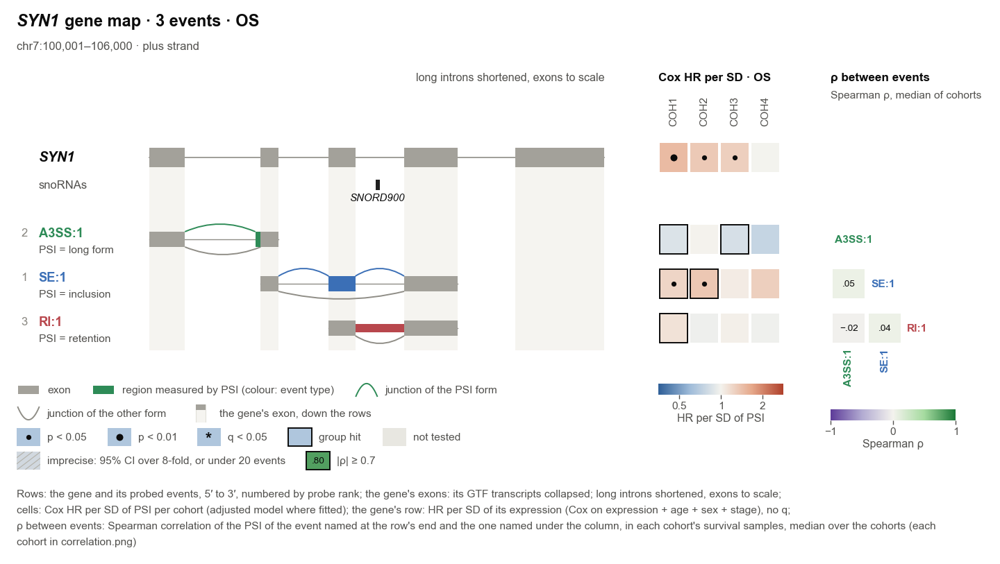
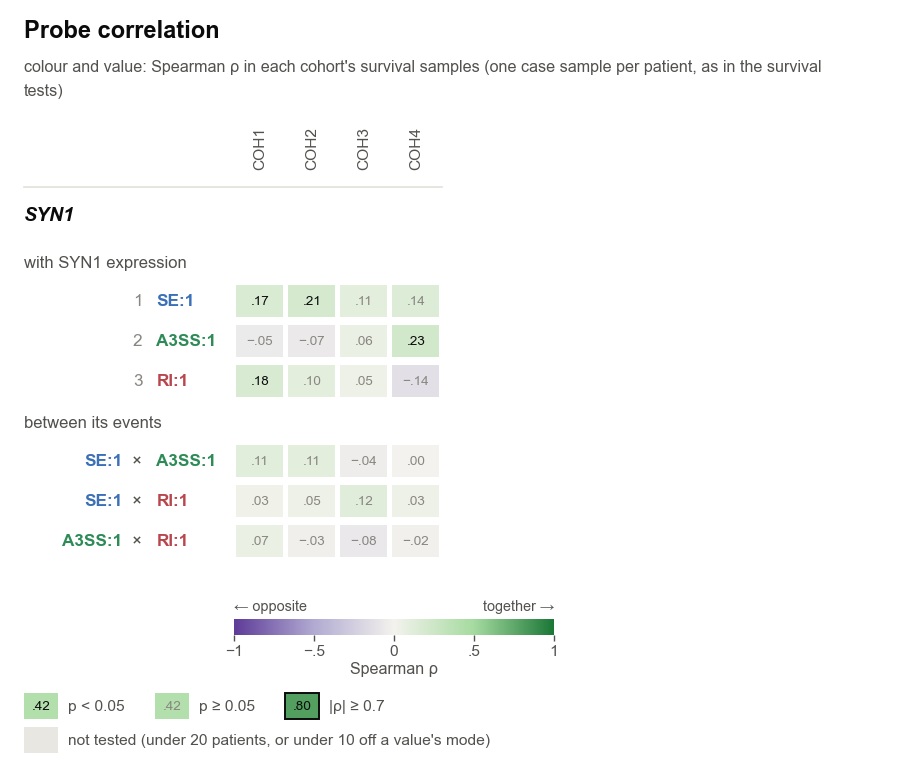

# Reading the results, panel by panel

A probe writes a report, an overview, an assay page for each of the best-ranked events (at most 30, `--max-pages`)
and the host gene's expression page. `panel` draws the same pages for the cohorts you choose. This guide walks through
one assay page from top to bottom, then the expression page and the probe's files.

The figures come from the synthetic example, so you can open the same files: run `splice-assay example demo/`, then
`splice-assay probe demo/data --gene SYN1 --gtf demo/data/annotation.gtf --proteins demo/proteins`. The cohorts are
COH1 to COH4, and "tumour" and "normal" stand for your case and reference groups. The page shows SYN1:SE:1 in
three cohorts, as `--top 3` draws them. By default a probe page shows the cohorts graded A+ to C, here COH2 and
COH1, and letters every graded cohort in the forest (section 5 explains the letters; the figures here are drawn
without them):
- COH1, with matched pairs;
- COH2, with too few pairs for a within-patient test;
- COH4, with no normal samples.

## The assay page

### 1. Title and gene schematic

- **Title.** Gene, event, the cohorts drawn and the endpoint. A subset (`--keep`, `--where`) and "page i of n" for a
  split page are added at the end.
- **Event details.** One line per event under the title: what the event is, its coordinates (1-based, inclusive, as a
  genome browser shows them), its length, what its value measures and the strand. Check it against the event you
  meant to look at.
- **Gene track.** The gene's collapsed model from the GTF: exons used by at least 10% of its transcripts. Nested small
  RNAs (snoRNAs, scaRNAs) are drawn in black underneath.
- **Event row.**
  - Grey blocks are the exons both forms share.
  - The coloured block is the region PSI measures, coloured by event type, with its length above.
  - Arcs above are the junctions of the form PSI counts; arcs below belong to the other form.
  - "PSI = inclusion" (or retention, …) says which form a high PSI means.
- **HITindex events.** For an alternative first or last exon (AFE, ALE), the grey blocks are the gene's other first
  or last exons and PSI is this exon's share of them. For a HIT event the value is the HIT index, from −1 (used as a
  first exon) to 1 (used as a last exon); the page says "HIT index" wherever it would say PSI, and its axes run
  from −1 to 1. HIT events appear only when asked for (`--include-hit`, or an event named with `--event`), and the
  footnote's q families then cover the gene's HIT-index events only.

### 2. Protein band (with a protein cache)

- **The sentence** says what the event would do to the protein: extra or missing residues in frame, a frameshift, or
  a change only in the UTR. It names the two annotated transcripts and their lengths. It is a suggestion read from
  annotation, never a measurement.
- **The bars** are the two forms' proteins on one residue axis.
  - Domains and repeats are boxes, disordered regions grey lines, and short motifs pins.
  - The event's residues are highlighted, and the triangle marks where the other form's region sits. An event that
    encodes no residue gets a triangle before residue 1 (5′ UTR) or after the last residue (3′ UTR, or only the stop
    codon).
- **No band** means no protein cache was given ([getting one](annotation-cache.md)), or no annotated transcript
  matches the event.

### 3. One cohort row: group view, KM curve, Cox model

**Left: tumour vs normal.** Two views share the PSI axis.
- **Pairs.** One line per patient with both samples: blue when PSI is higher in the tumour, grey when lower. The black
  line joins the medians.
  - The header gives the number of pairs.
  - Δ is the median of the within-patient differences.
  - p comes from the exact signed-rank test.
- **All samples.** Every reference and case patient, one point each, with boxes; diamonds mark the medians. A
  patient with several samples in a group (e.g. replicate aliquots) is shown, and tested, as their mean; the numbers
  under the groups count patients.
  - Δ is the median of the tumours minus the median of the normals.
  - p comes from the Mann–Whitney test.
  - The dotted line is the KM split. When the median is the highest PSI, the line sits at it, and the patients on it
    form the high arm.
- **Hits and q.** A design is a hit when p < 0.05, |Δ| > 0.10, the Hodges–Lehmann shift agrees in sign, and the result
  survives dropping PSI values of exactly 0 or 1. A q line appears when the gene has at least 10 such tests, with a
  `*` when q < 0.05.

**Middle: Kaplan–Meier.** The cohort is split at the median PSI of its survival samples (or the mean, or a value set
with `--km-split`); PSI at or below the split is the low arm. When more than half the patients share the highest
PSI (often 1), no one is above the median, so PSI at the median is the high arm and PSI below it the low arm.
- **Header.**
  - The split: "split at median PSI 0.7705", "split at median PSI 1 (high: at the median)" when the median is the
    highest value, or "split at PSI 0.5 (set)" for a value you gave.
  - The log-rank HR (high vs low) and p, then q (with `*` when q < 0.05) and the events per arm.
- **Curves.** 95% bands, with ticks for censored patients. The at-risk table counts patients still followed.
- **A † after the log-rank p**, with a last line "† non-proportional hazards (p …)": the hazard ratio between the arms
  changes over follow-up, for example when the curves cross. The log-rank test still ran; it averages that change.

**Right: the Cox model** of this cohort, adjusted for host expression and the clinical terms (by default age, sex and
stage).
- **Header.** Patients and events in the fit, and the q of the PSI term. The second line gives the model, with any
  notes in brackets (next section).
- **Rows.** Each term's HR with its 95% CI and p, on one shared axis.
  - PSI is per SD of PSI in this cohort (bold, diamond), or per IQR with `--hr-unit iqr`. Host expression and age are
    per SD. Categories are against
    the reference level named.
  - Filled markers have p < 0.05 (in the legend: the diamond for PSI as in the forest, squares for the other
    terms).
  - A † after a row's p: that term failed the proportional-hazards test (p < 0.05), so its HR is an average over
    follow-up.
  - A `*` after the PSI row's p: its q (shown in the header) is below 0.05.

### 4. When a cohort cannot be fully tested, and model notes

- **Missing group view.**
  - "No tumour vs normal test: no normal samples" (COH4) means the cohort has no reference samples.
  - "5 pairs (< 10): no within-patient test" (COH2) means only the all-samples comparison ran.
- **KM or Cox not run.** The panel names the gate that stopped it: PSI too sparse, too few patients or events, or no
  variation.
- **Model notes** in brackets are cautions. The model was fitted and nothing is removed:
  - `low power: 14 events (< 20)` (and ‡ after the forest CI): the fit ran with few deaths. Its CI is wide, a p ≥ 0.05
    says little, and a significant HR from few deaths is likely inflated;
  - `6.7 events per term (< 10)`: few deaths for the number of terms, so expect wide CIs (an overfit risk);
  - `narrow PSI range (SD 0.040 < 0.05)`: the HR per SD describes a change of a few PSI points;
  - `non-proportional hazards: PSI (p …)`: that term's effect changes over follow-up, so the HR is an average. Look at
    the KM curves;
  - `stage I merged into II (2 patients, 0 events)`: a level too rare to estimate joined its neighbour, so the
    reference reads "I–II";
  - `stage left out (0% recorded)`: a covariate recorded for under 80% of the cohort is not in its model;
  - `host expression left out (no values)`, `(45% recorded)` or `(constant)`: the host gene's expression is missing,
    recorded for under 80% of the cohort, or constant there, so the model is PSI alone in this cohort;
  - `unstable: …`: a term with a standard error above 3, per SD (or IQR) or per level: a 95% CI wider than 100,000-fold.
    For a covariate this is usually a sparse level. For PSI itself (`unstable: PSI`) the fit has broken down, often
    because a few patients away from the common PSI carry it, and its HR and p mean little; the report lists those
    fits. A term penalized by `--ridge` keeps its standard error per SD or per level below 1/√λ (1 at the
    default), so it goes unflagged there.

### 5. The forest of all cohorts

- **Left.** The median PSI difference (tumour − normal) in every cohort with a test. Filled circles are within
  patients, open circles all samples. Dotted lines mark the ±0.10 effect threshold.
- **Right.** The HR per SD (or per IQR) of PSI with its 95% CI, from the base model (PSI + host expression, written under the
  axis), so all cohorts are compared under one model.
  - Filled diamonds have p < 0.05.
  - Arrowheads mark a CI that runs off the axis.
  - A `*` after a CI: that fit's q is below 0.05. The fill shows p, the `*` shows q.
  - A † after a CI: the PSI term of that fit failed the proportional-hazards test.
  - A ‡ after a CI: that fit had fewer than 20 events (low power). It ran, but its CI is wide, and p ≥ 0.05 there
    says little against an association.
- **Shading** marks the cohorts drawn above. Look for the same direction across cohorts.
- **Evidence letters** (probe pages) mark every cohort with a grade, beside its name. Each cohort row's heading
  repeats its grade and its three lines, e.g. "COH1 · Evidence A+  Cox ↑  KM ↑  T/N ↑".
  - **Each line** is ↑ or ↓ when significant, in parentheses when not, = with no direction (not significant and
    tiny: an HR within 1.1-fold of 1, or a PSI change under 0.05), – when not tested. ↑
    means a higher hazard with higher PSI (Cox: the adjusted model where fitted; an imprecise fit is not significant
    but keeps its direction), a higher hazard in the high arm (KM), or PSI higher in tumours (T/N: significant when
    either test is a group hit).
  - **The grades:**
    - **A:** Cox and KM p < 0.05;
    - **B:** Cox alone;
    - **C:** KM alone;
    - A, B and C have no line pointing the other way, and **+** adds a significant T/N change pointing the same way;
    - **D:** a survival test p < 0.05, but another line points the other way;
    - **E:** significant lines in opposite directions.
  - **Which cohorts get a row:** those graded A+ to C. A page with none shows the event's strongest cohort and says
    "no cohort graded A–C" in its title.

### 6. Legend and footnote

- **The legend** covers every symbol on the page. When the page carries a `*`, a † or a ‡, the legend adds
  "* q < 0.05 (Benjamini–Hochberg)", "† non-proportional hazards (p < 0.05)" or "‡ fewer than 20 events: low
  power".
- **The footnote** names the q families with their sizes (Benjamini–Hochberg within the gene, one family per kind of
  test) and lists any setting changed from the defaults. A page from relaxed gates always says so.

## The expression page

With an expression table, the host gene's own expression has a page of its own. A probe puts it last
(`pages/SYN1_expression.png`), and `panel` writes it beside the event page (`SYN1_expression_…`), so the splicing
pages do not repeat it.
- **The forest** at the top covers every cohort with an expression test. Left: Δ median expression (tumour − normal).
  Right: the Cox HR per SD of expression. The cohorts drawn below are shaded.
- **One row per cohort** of the gene's splicing pages, with the same three views:
  - **Tumour vs normal.** A hit needs a two-fold change (|Δ| > 1 on a log2 scale).
  - **KM.** The split is at the median expression by default (`--km-split-expression`), and the header says where.
  - **Cox.** Expression per SD plus the same clinical terms.

These results are not FDR-adjusted. Read them beside the splicing pages:
- a splicing association where expression itself is not prognostic is easier to interpret;
- one where expression is equally prognostic may be an expression echo. The splicing model adjusts for expression,
  so check that the PSI term holds there.

## The probe's files

### report.md: start here

| Section | What it tells you |
|---|---|
| What was run | Events, cohorts, subset, endpoint, the two models as fitted (with the clinical columns read and their cleaned values), a ridge penalty and the terms it reached (`--ridge`), and any setting changed from the defaults |
| How much is chance | For each model and KM: tests run, how many have p < 0.05, and how many chance alone would give |
| Notes on the survival tests | How many fits carry each note (narrow PSI range, overfit risk, low power, host expression left out, non-proportional hazards), naming the flagged fits with p < 0.05, and how many fits `--min-events-per-term` stopped |
| Ranked events | One row per event with its counts (with how many of the Cox hits are low power, ‡, which rank after the others), best cohort, HR, p (‡ when that fit has low power), the suggested protein change and a link to its page (§ when PSI barely varies in the best cohort, so there is no HR) |
| Protein changes, Host-gene expression | What the suggestions and the expression page are, and where to find them |
| Correlation (with `--correlation`) | How many correlations were tested and how many have p < 0.05 against chance, the strong ones (\|ρ\| ≥ 0.7), and how to read them |
| Files, Reproduce | The outputs, and the exact command that made them |

`agent_prompt.md` holds this report too, with instructions for an agent and the notable cohorts of the best-ranked
events. `splice-assay summarize` turns it into `agent_summary.md`, a short narrative written by Claude Code. That
narrative is a draft: a number check under it flags numbers it quotes that the results do not print, and HRs not
printed with their CI, p and q for the event and cohort it names. Read it against this report and the pages.

### overview.png: every event and cohort at once

- **Colour** is the HR per SD of PSI (of the HIT index for HIT events), from the adjusted model where it was fitted.
  The colour bar runs from HR 0.35 or lower to 2.8 or higher, lower hazard to the left. The caption names a ridge
  penalty when those fits have one.
- **Marks.** The key beside the colour bar shows each one as drawn: a dot is p < 0.05 (a large dot p < 0.01); a `*`
  replaces it when q < 0.05; a frame marks a tumour–normal hit; grey cells were not tested.
- **Pale, hatched cells are imprecise:** the 95% CI spans more than 8-fold (`imprecise_ci_ratio`), or the fit has
  fewer than 20 events. Their HR is the least reliable number on the figure, and the most extreme HRs often come
  from such fits, so their colour is muted toward the middle while keeping its direction. A dot there still means
  p < 0.05, but the size of the effect is unknown. A whole hatched column is a cohort with few deaths.
- **At the right of each row:** the cohorts with p < 0.05 of those tested (`3/27`), the number chance would give
  (5% of the tested cohorts, `1.4`), and how many of the hits have an HR above (↑) or below (↓) 1. An event with
  hits well above chance, in one direction, is worth more than one dark cell.
- **Rows** follow the ranking; each event's label has its type's colour, as on the gene maps and the pages.
- **The last row** (with an expression table) is the host gene's own expression: the HR per SD of expression from
  Cox on expression + age + sex + stage, a dot for p < 0.05 and a frame for a tumour–normal expression hit
  (|Δ| > 1). It has no `*`, because expression is not adjusted for multiple testing. A column where the events and
  the gene's expression share a colour and a dot is one to read on the expression page before crediting the
  splicing.

### gene_map_GENE.png: where on the gene

One per gene of the overview's best-ranked events (at most 20), after the overview in `probe.pdf`: the overview's
results laid out along the gene.
- **Rows.** The gene first, then its probed events from 5′ to 3′ (the best-ranked 40 at most). The grey number is
  each event's rank. Each event is drawn as on its page: constant exons grey, the region PSI measures in the event's
  colour, the junctions of the PSI form arched above and of the other form below.
- **The gene.** Its collapsed model from the GTF, with nested snoRNAs. Pale columns carry its exons down through
  the event rows, so you can see which exons each event shares. Long introns are drawn shortened, and so are exons
  far longer than the gene's typical exon; the header says which. Without a GTF there is no gene model. Events that
  are not drawn are counted under the title: those observed in under half of every cohort's survival samples
  (`--min-observed`; in TCGA data often most of a gene's annotated events), and those without usable coordinates.
- **Cells.** The overview's cells for each row: the HR per SD in each cohort, with the same dot, `*`, frame and
  pale hatching. The gene's own row holds its expression's HR.
- **The key** under the gene shows the drawing (exon, region measured by PSI, the two junctions, an exon's column)
  and the cells' marks, beside the colour bars.
- **ρ between events** (with `--correlation`): a lower triangle over the event rows. Each cell is the Spearman ρ
  between two events' PSI, computed in each cohort and summarised by its median over the cohorts. The cell's row
  event is named at the row's end, on the diagonal, and its column event under the column. A frame marks |ρ| ≥ 0.7.
  Each event's ρ with the gene's expression is in `correlation.png` and `cells.csv` (`expr_rho`).
- **Reading it.** Hits that cluster in one part of the gene, or that come from events sharing exons (a column runs
  through both), may be one change seen several times. The triangle says whether those events also move together.

### correlation.png: what moves together, cohort by cohort (with `--correlation`)

- **Gene by gene**, in the order of their best rank: first each event against the gene's expression (by rank), then
  each pair of its events (the better-ranked event on the left).
- **At most 60 rows.** With more, the expression rows of the best-ranked events take at most half (more when there
  are few pairs), and the pairs among each gene's best-ranked events the rest (its events added in rank order, the
  genes taking turns), so the page shows whether the top hits move together. The caption says how many rows are
  shown; the gene map's triangle has the median of every pair. Pairs near 1 usually measure the same change twice:
  rMATS lists an exon with slightly different boundaries, or with different flanking exons, as separate events.
- **Colour and value** are Spearman ρ in the cohort's tumour samples (one per patient, the survival samples): green
  positive, purple negative. The value is black where p < 0.05 and grey otherwise. A frame marks |ρ| ≥ 0.7, and a
  grey cell was not tested; the key beside the colour bar shows each. With many cohorts the cells are too narrow
  for values, and a dot marks p < 0.05.
- **With host-gene expression:** a strong ρ means the event's PSI largely follows the gene's level: its adjusted HR
  then has a wider CI, and a KM hit could be expression's.
- **Between events:** a strongly correlated pair counts as one piece of evidence. Two alternative first (or last)
  exons of a gene sum to 1, so they are near −1 by construction; with more such exons a pair can go either way.
- `correlations.csv` holds every value with its n, p and q; the gene maps show the median over the cohorts.

### The tables

| File | One row per | Key columns |
|---|---|---|
| `events.csv` | event (ranked) | `rank`, `measurable`, `adj_cox_p05`, `adj_cox_p05_low_power`, `cox_p05`, `cox_p05_low_power`, `km_p05`, `group_hits`, `evidence_a_c`, `evidence_best`, `best_cohort`, `best_model`, `best_hr_per_sd`, `best_p`, `best_low_power`, `protein_change`, `page` |
| `cells.csv` | event × cohort | `evidence` (the grade), `evidence_lines` (Cox, KM, T/N), `paired_*` and `unpaired_*` (Δ, p, q, hit), `km_*` (with `km_ties_high`, `km_ph_p`, `km_notes`), base Cox (`cox_p`, `cox_q`, `hr_per_iqr`, `ph_p`, `cox_events_per_term`, `psi_narrow`, `psi_unstable`, `cox_notes`), adjusted Cox (`adj_*`) |
| `expression_cells.csv` | host gene × cohort | the same tests for expression (HR per SD) |
| `correlations.csv` (with `--correlation`) | pair × cohort | `kind` (expression, event), `event_id`, `partner`, `rho`, `corr_p`, `corr_q`, `corr_n`, `corr_status`; `expr_rho` in `cells.csv`, `best_expr_rho` in `events.csv` |
| `proteins.csv` | event | the matched transcripts, how they matched, residues, effect and features |
| `pages/*.csv` | plotted value | every number a page draws or prints, with a `.provenance.json` (input hashes, settings, versions) |

## A reading order

1. **In `report.md`**, compare the p < 0.05 counts with what chance gives, then read the notes section.
2. **On the overview**, read each row's counts at the right (hits against chance, and their directions) before its
   darkest cell, and discount pale, hatched cells: a strong colour with a dot and no hatching is the candidate.
3. **On the gene map**, see where the hits sit on the gene and whether they come from events that share exons (or,
   with `--correlation`, that move together).
4. **Open the pages** of the top-ranked events.
5. **On each page:**
   - **Details line:** is this the event you meant?
   - **Group view:** is there a tumour–normal change, and does it hold within patients?
   - **KM:** do the curves separate steadily, or do they cross (a †)?
   - **Model:** does the PSI term hold with the clinical terms, and does the header carry notes?
   - **Forest:** do the other cohorts point the same way? Which carry a grade, and are any D or E (lines that
     disagree)?
6. **On the expression page** (the last one): is the gene's level itself shifted or prognostic, and in which
   cohorts? Where expression is equally prognostic, a splicing association could be an expression echo.
7. **Trust convergence.** Converging evidence is the same direction in several cohorts, a group hit in the same cohort,
   and an association that survives adjustment. One small p is not. Everything a probe prints is nominal.
